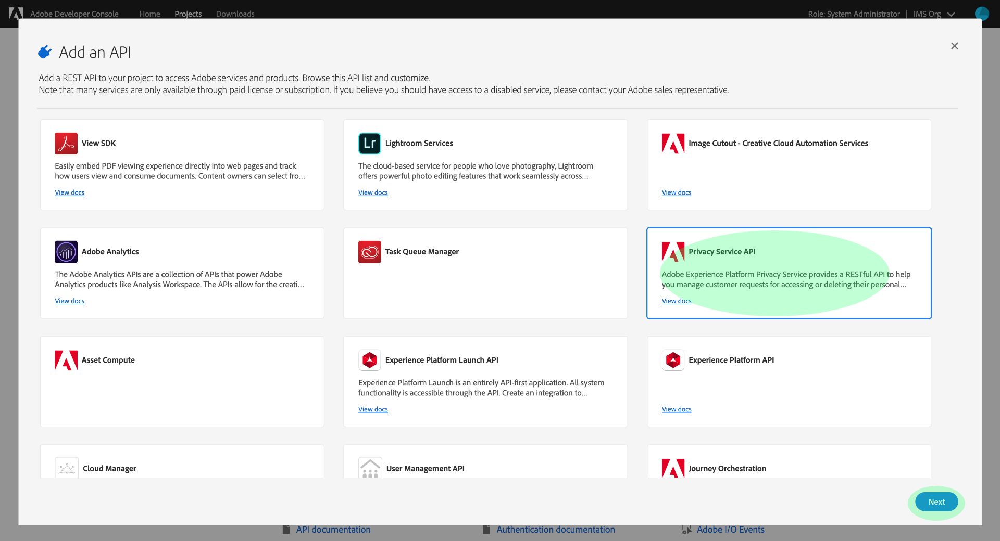

# Privacy Service module in aepp

This documentation will provide you some explanation on how to use the Privacy Service module and different methods supported by this module.\
It will include some examples but be aware that not all methods will be documented here.\
To have a full view on the different API endpoints specific to the schema API, please refer to this [API documentation](https://developer.adobe.com/experience-platform-apis/references/privacy-service/).\
Alternatively, you can use the docstring in the methods to have more information.

## Important Information about the Privacy Service API

The privacy service API is not really part of the AEP APIs but as it is described in the same page, there is here a support for it.\
If you wish to have access to this API, you will need to add a new service in your environment of Adobe.io.\
In console.adobe.io, you will need to add the Privacy Service element.



## What is the Privacy Service ?

The Privacy Service API is not really part of the AEP API as described above. It allows you to generate request to delete users data as they request it from the different regulation (GDPR, CCPA, ...).\
In order to achieve the requests, you will need to have the different user ID when the request is generated by the user. In order to help you in that task, Adobe provides an additional (JS) library that you can have on your website.

[The privacy JS library](https://experienceleague.adobe.com/docs/experience-platform/privacy/js-library.html?lang=en) is the library that you can run on the browser in order to retrieve the different identities requires for the request to have the information required to run the Privacy Service requests.

The Privacy Service is not only taking care of the Adobe Experience Platform data. It can take care of the data for the following different solutions:
* Adobe Advertising Cloud
* Adobe Analytics
* Adobe Audience Manager
* Adobe Campaign Standard
* Adobe Customer Attributes (CRS)
* Adobe Primetime Authentication
* Adobe Target
For more information, you can read the documentation about [supported tools](https://experienceleague.adobe.com/docs/experience-platform/privacy/experience-cloud-apps.html?lang=en#self-serve).

## Importing the module

Before importing the module, you would need to import the configuration file, or alternatively provide the information required for the API connection through the configure method. [see getting starting](./getting-started.md).\
Note that on top of the default setting, you need to have added the Privacy Service in Adobe.io.

To import the module you can use the import statement with the `privacyservice` keyword.

```python
import aepp
aepp.importConfigFile('myConfig_file.json')

from aepp import privacyservice
```

The `privacyservice` module provides a class that will generate the connection to the API (see below).\
The following documentation will provide you with more information on its capabilities.

## The Privacy class

The `Privacy` class uses the default API connector that you would encounter for any other submodules on this python module.\
This class can be instantiated by calling the `Privacy()` from the `privacyservice` module.

Following the previous method described above, you can realize this:

```python
privacy = privacyservice.Privacy()
```

2 parameters are possible for the instantiation of the class:

* privacyScope : REQUIRED : set the connection retrieved process with the Privacy JWT scope (default True)
* aepScope : OPTIONAL : set the connection retrieved process with the AEP JWT scope if set to True (default False)
* config : OPTIONAL : config object in the config module. (example : aepp.config.config_object)
* header : OPTIONAL : header object  in the config module. (example: aepp.config.header)

## Use-cases

### Sample Payload

The `Privacy` class, once instantiated provde a sample payload that you can use for your different requests.\
The payload is hosted on the `SAMPLE_PAYLOAD` attribute.\
It gives you the following elements:

```python
{
"companyContexts": [
{
    "namespace": "imsOrgID",
    "value": "{IMS_ORG}"
}
],
"users": [
{
    "key": "DavidSmith",
    "action": ["access"],
    "userIDs": [
    {
        "namespace": "email",
        "value": "dsmith@acme.com",
        "type": "standard"
    },
    {
        "namespace": "ECID",
        "type": "standard",
        "value":  "443636576799758681021090721276",
        "isDeletedClientSide": False
    }
    ]
},
{
    "key": "user12345",
    "action": ["access","delete"],
    "userIDs": [
    {
        "namespace": "email",
        "value": "ajones@acme.com",
        "type": "standard"
    },
    {
        "namespace": "loyaltyAccount",
        "value": "12AD45FE30R29",
        "type": "integrationCode"
    }
    ]
}
],
"include": ["Analytics", "AudienceManager"],
"expandIds": False,
"priority": "normal",
"analyticsDeleteMethod": "anonymize",
"regulation": "ccpa"
}
```

### Create Jobs & append

You can create privacy requests by using the `postJob` method that is provided in the instance of the class.\
It takes only one argumentm, the dictionary that is provided to you can help you create the dictionary.

You can have a look at this documentation to help you define the product values and Namespace qualifiers: [Appendix Privacy Service](https://experienceleague.adobe.com/docs/experience-platform/privacy/api/appendix.html?lang=en#namespace-qualifiers)

Example:
```python
## all previous initialization are skipped here.
privacy = privacyservice.Privacy()

dictDefinition = {
"companyContexts": [
{
    "namespace": "AGS 862",
    "value": "12DSQ234SUFE@adobe.com"
}
],
"users": [
{
    "key": "DavidSmith",
    "action": ["access"],
    "userIDs": [
    {
        "namespace": "email",
        "value": "dsmith@acme.com",
        "type": "standard"
    },
    {
        "namespace": "ECID",
        "type": "standard",
        "value":  "443636576799758681021090721276",
        "isDeletedClientSide": False
    }
    ]
},
{
    "key": "user12345",
    "action": ["access","delete"],
    "userIDs": [
    {
        "namespace": "email",
        "value": "ajones@acme.com",
        "type": "standard"
    },
    {
        "namespace": "loyaltyAccount",
        "value": "12AD45FE30R29",
        "type": "integrationCode"
    }
    ]
}
],
"include": ["AdobeCloudPlatform"],
"expandIds": False,
"priority": "normal",
"analyticsDeleteMethod": "anonymize",
"regulation": "gdpr"
}

myJob = privacy.postJob(dictDefinition)
```

The response hosted in `myJob` will be like the following one:

```JSON
{
    "jobs": [
        {
            "jobId": "6fc09b53-c24f-4a6c-9ca2-c6076b0842b6",
            "customer": {
                "user": {
                    "key": "DavidSmith",
                    "action": [
                        "access"
                    ]
                }
            }
        },
        {
            "jobId": "6fc09b53-c24f-4a6c-9ca2-c6076be029f3",
            "customer": {
                "user": {
                    "key": "user12345",
                    "action": [
                        "access"
                    ]
                }
            }
        },
        {
            "jobId": "6fc09b53-c24f-4a6c-9ca2-c6076bd023j1",
            "customer": {
                "user": {
                    "key": "user12345",
                    "action": [
                        "delete"
                    ]
                }
            }
        }
    ],
    "requestStatus": 1,
    "totalRecords": 3
}
```

You can use the `jobId` to add additional element to that job, by using the `postChildJob` method.

### Get Jobs

The 2nd main use-case of that API is to check on the status of the job.\
Once you have received a `jobId`, you can check the status of the job with it by using the `getJob` method.

`privacy.getJob("6fc09b53-c24f-4a6c-9ca2-c6076bd023j1")`

Alternatively, you can use the `getJobs()` method to retrieve all jobs of your organization.